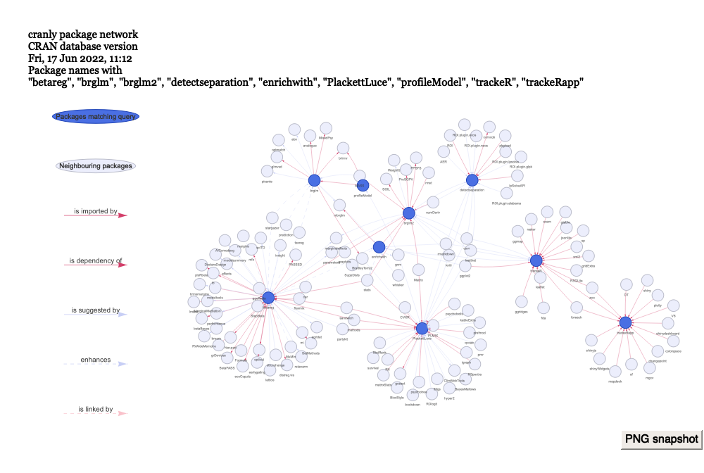
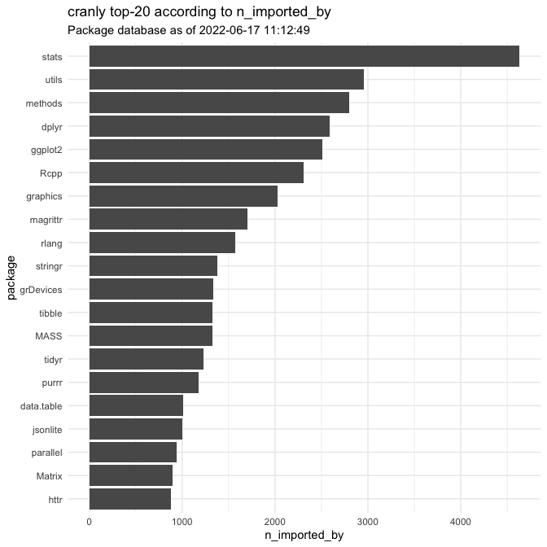
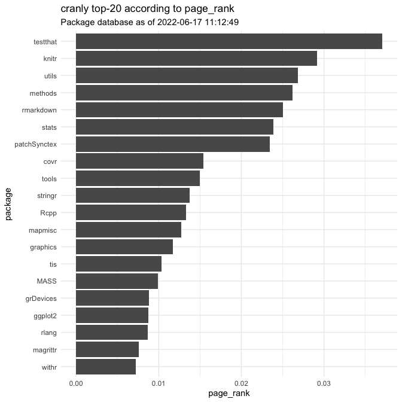
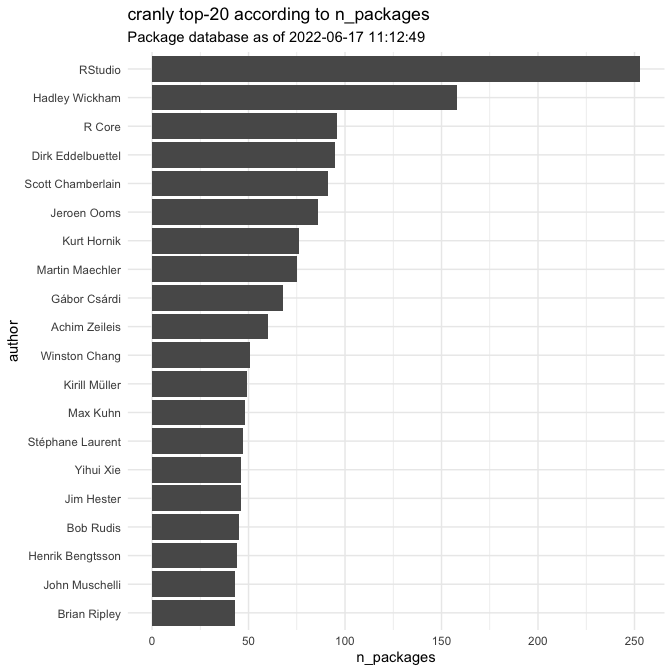
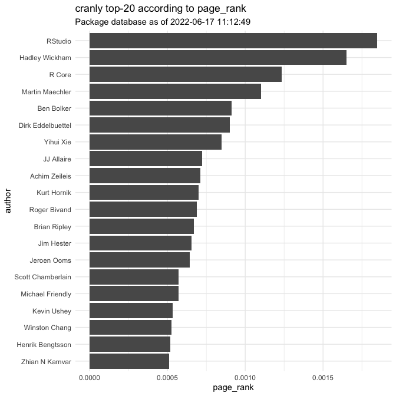

<!-- README.md is generated from README.Rmd. Please edit that file -->

# cranly

[**cranly**](https://github.com/ikosmidis/cranly) provides core
visualizations and summaries for the CRAN package database. It is aimed
mainly as an analytics tool for developers to keep track of their CRAN
packages and profiles, as well as those of others, which, at least for
me, is proving harder and harder with the rapid growth of the
[CRAN](https://cran.r-project.org) ecosystem.

The package provides methods for cleaning up and organizing the
information in the CRAN package database, for building package
directives networks (depends, imports, suggests, enhances, linking to)
and collaboration networks, and for computing summaries and producing
interactive visualizations from the resulting networks. Network
visualization is through the
[**visNetwork**](https://CRAN.R-project.org/package=visNetwork) package.
The package also provides functions to coerce the networks to
[igraph](https://CRAN.R-project.org/package=igraph) objects for further
analyses and modelling.

### Installation

Install the development version from github:

    # install.packages("devtools")
    devtools::install_github("ikosmidis/cranly")

### Collaboration and package directives networks in CRAN

Load **cranly** as

    library("cranly")

The first step in the **cranly** workflow is to try and “clean-up” the
package and author names in the data frame that results from a call to
`tools::CRAN_package_db()`

    p_db <- tools::CRAN_package_db()
    package_db <- clean_CRAN_db(p_db)

The CRAN database we use is from

    attr(package_db, "timestamp")
    #> [1] "2022-06-17 11:12:49 BST"

#### Package directives networks

The package directives network can then be built using

    package_network <- build_network(package_db)

`package_network` can then be interrogated using extractor methods (see,
`?package_by`). For example, my packages can be extracted as follows

    my_packages <- package_by(package_network, "Ioannis Kosmidis")
    my_packages
    #> [1] "betareg"          "brglm"            "brglm2"           "detectseparation"
    #> [5] "enrichwith"       "PlackettLuce"     "profileModel"     "trackeR"         
    #> [9] "trackeRapp"

and their sub-network of directives can be summarized in an interactive
visualization, a snapshot of which is below

    plot(package_network, package = my_packages, title = TRUE, legend = TRUE)

We can also compute package summaries and plot “Top-n” lists according
to the various summaries

    package_summaries <- summary(package_network)
    plot(package_summaries, according_to = "n_imported_by", top = 20)

    plot(package_summaries, according_to = "page_rank", top = 20)

#### Collaboration networks

The collaboration network can also be built using a similar call

    author_network <- build_network(package_db, perspective = "author")

and the extractor functions work exactly as they did for the package
directives network. For example, my collaboration network results can be
summarized as an interactive visualization, a snapshot of which is below

    plot(author_network, author = "Ioannis Kosmidis")

“Top-n” collaborators according to various summaries can again be
computed

    author_summaries <- summary(author_network)
    plot(author_summaries, according_to = "n_collaborators", top = 20)

    plot(author_summaries, according_to = "n_packages", top = 20)

    plot(author_summaries, according_to = "page_rank", top = 20)

Well, the usual suspects…

#### Package dependence trees

Since version 0.2 **cranly** includes functions for constructing and
working with package dependence tree objects. A package’s dependence
tree shows what else needs to be installed with the package in an empty
package library with the package, and hence it can be used to + remove
unnecessary dependencies that “drag” with them all sorts of other
packages + identify packages that are heavy for the CRAN mirrors +
produced some neat visuals for the package

For example, the dependence tree of the **PlackettLuce** R package I am
co-authoring is

    PL_dependence_tree <- build_dependence_tree(package_network, "PlackettLuce")
    plot(PL_dependence_tree)

**cranly** also implements a *package dependence index* (see
?summary.cranly\_dependence\_tree for mathematical details). The closer
that is to 0 the “lighter” the package is

    summary(PL_dependence_tree)
    #> $package
    #> [1] "PlackettLuce"
    #> 
    #> $n_generations
    #> [1] 3
    #> 
    #> $parents
    #>  [1] "CVXR"        "igraph"      "Matrix"      "matrixStats" "partykit"   
    #>  [6] "psychotools" "psychotree"  "qvcalc"      "R6"          "RSpectra"   
    #> [11] "sandwich"   
    #> 
    #> $dependence_index
    #> [1] 0.6107209

Check the package vignettes for a more comprehensive tour of the package
and for network visualizations on authors with orders of magnitude
larger collaboration networks than mine.

### Code of Conduct

Please note that this project is released with a [Contributor Code of
Conduct](CONDUCT.md). By participating in this project you agree to
abide by its terms.
