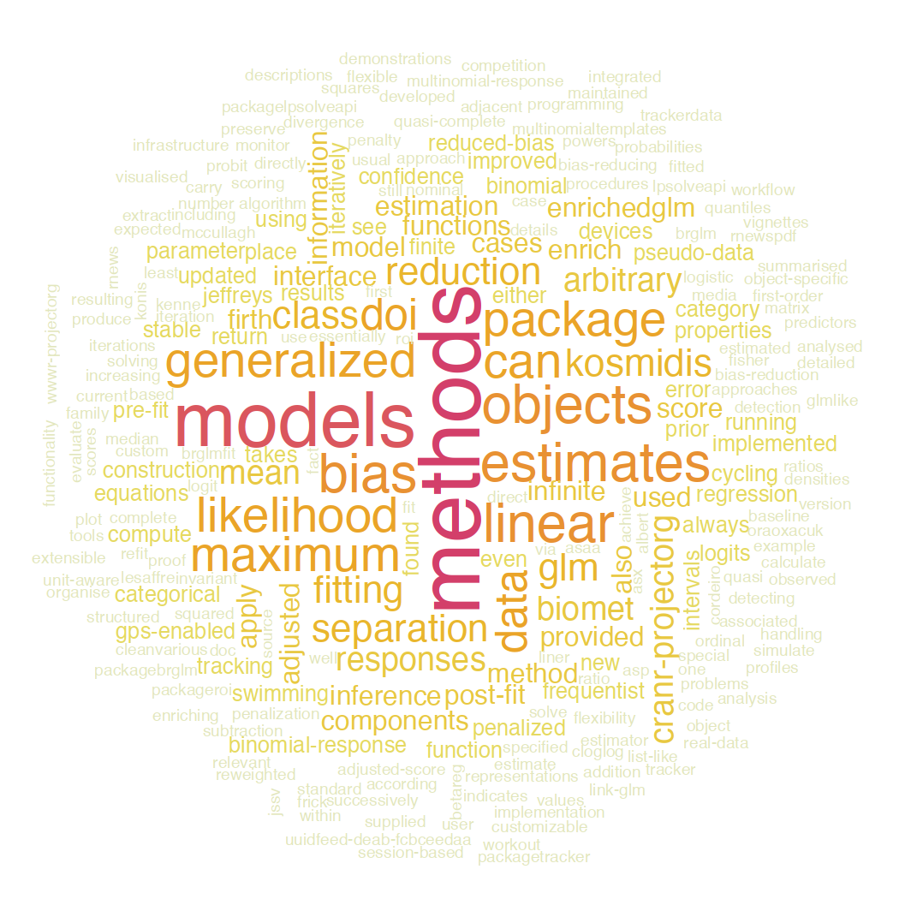
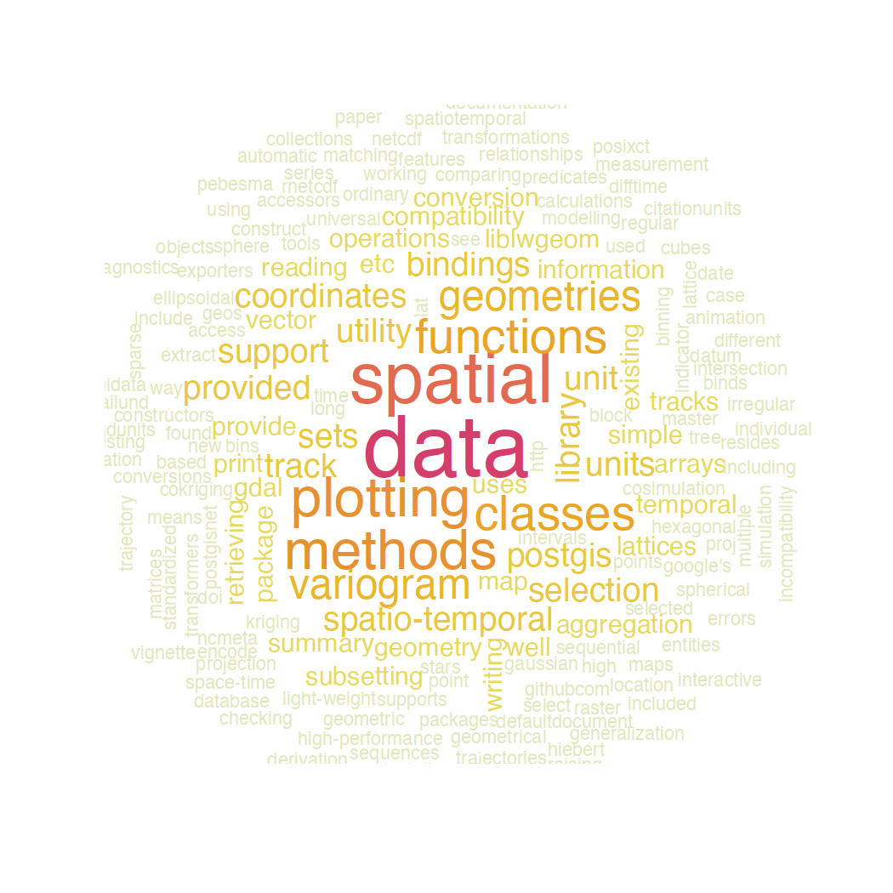
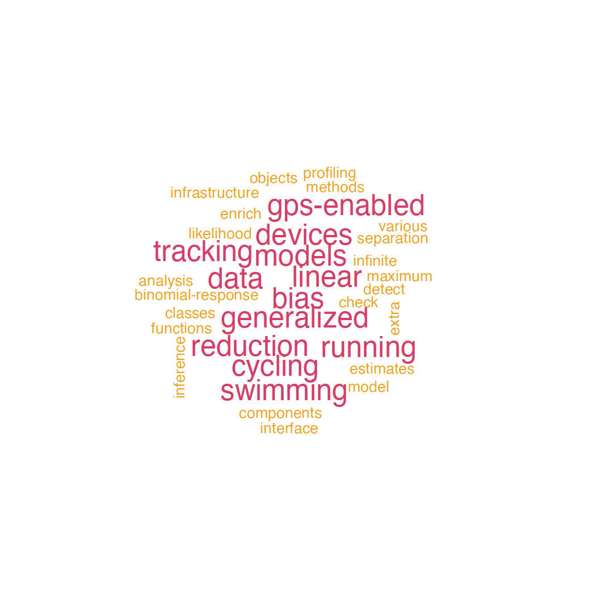
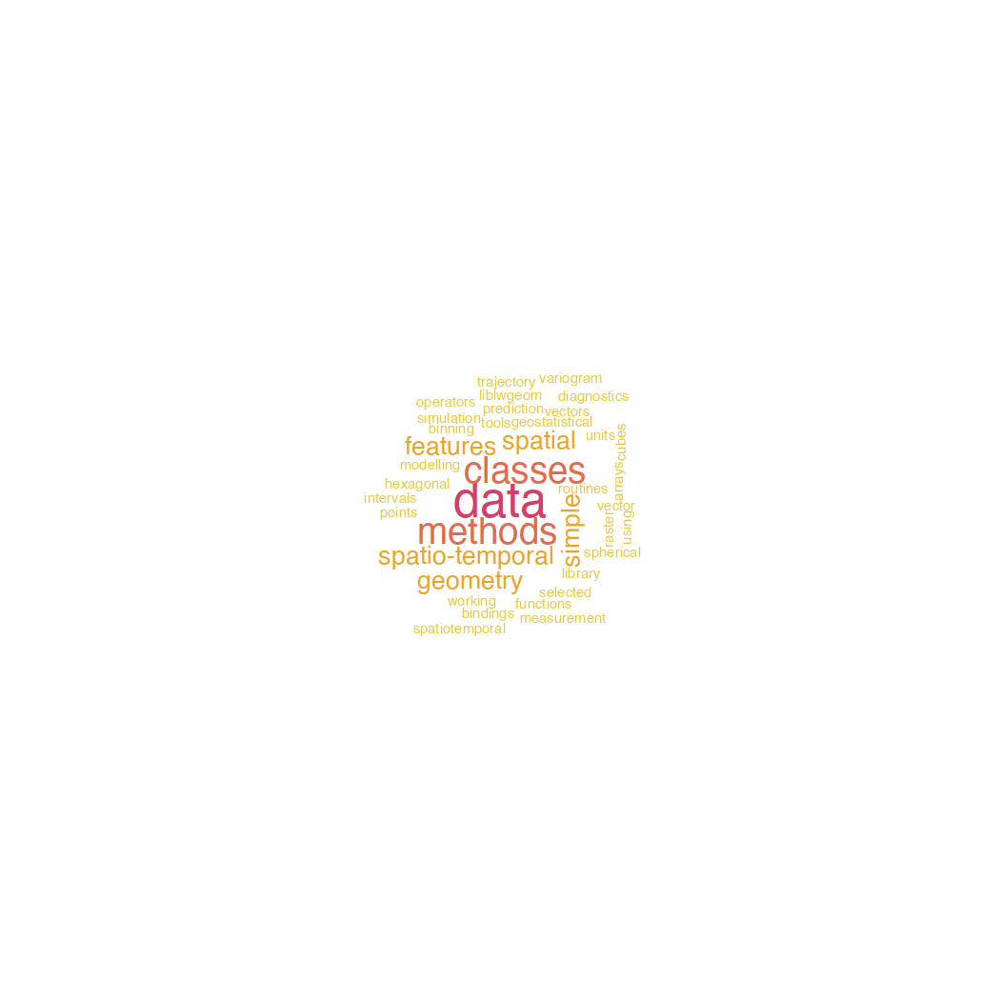

# **cranly** extractor functions

Since version 0.3, **cranly** includes functions for extracting information from `cranly_network` objects (see `?extractor-functions`). All extractor functions in `cranly` try to figure out what `y` is in the statements

`y` is [the] `extractor-function` a `package`/`author`

### CRAN package directives and author collaboration networks

Let's attach **cranly**

```r
library("cranly")
```
and use instances of the package directives and author collaboration networks

```r
package_network <- readRDS(url("https://raw.githubusercontent.com/ikosmidis/cranly/develop/inst/extdata/package_network.rds"))
author_network <- readRDS(url("https://raw.githubusercontent.com/ikosmidis/cranly/develop/inst/extdata/author_network.rds"))
```
from CRAN's state on 2022-08-26 14:43:43 BST

Alternatively, today's package directives and author collaboration networks can be constructed by doing

```r
cran_db <- clean_CRAN_db()
package_network <- build_network(cran_db)
author_network <- build_network(cran_db, perspective = "author")
```

# Example queries

#### Packages by Kurt Hornik

```r
package_network |> package_by("Kurt Hornik", exact = TRUE)
#>  [1] "arules"             "bibtex"             "bindata"           
#>  [4] "cclust"             "chron"              "clue"              
#>  [7] "cluster"            "coin"               "colorspace"        
#> [10] "cordillera"         "ctv"                "date"              
#> [13] "dendextend"         "digest"             "e1071"             
#> [16] "exactRankTests"     "fortunes"           "gap"               
#> [19] "gsignal"            "ISOcodes"           "isotone"           
#> [22] "kernlab"            "lpSolveAPI"         "MASS"              
#> [25] "mda"                "mistr"              "movMF"             
#> [28] "mvord"              "nloptr"             "NLP"               
#> [31] "NLPclient"          "NLPutils"           "OAIHarvester"      
#> [34] "openNLP"            "openNLPdata"        "opGMMassessment"   
#> [37] "oz"                 "pandocfilters"      "party"             
#> [40] "polyclip"           "polynom"            "PolynomF"          
#> [43] "princurve"          "qrmdata"            "qrmtools"          
#> [46] "Rcplex"             "relations"          "Rglpk"             
#> [49] "RKEA"               "RKEAjars"           "ROI"               
#> [52] "ROI.plugin.msbinlp" "Rpoppler"           "Rsymphony"         
#> [55] "RWeka"              "RWekajars"          "seriation"         
#> [58] "sets"               "signal"             "skmeans"           
#> [61] "slam"               "stablelearner"      "strucchange"       
#> [64] "strucchangeRcpp"    "tau"                "textcat"           
#> [67] "textplot"           "tm"                 "tm.plugin.mail"    
#> [70] "topicmodels"        "tseries"            "TSP"               
#> [73] "Unicode"            "vcd"                "W3CMarkupValidator"
#> [76] "WeightSVM"          "wordnet"
```

#### Packages by people named "Ioannis"

```r
package_network |> package_by("Ioannis")
#>  [1] "BCT"              "betareg"          "brglm"            "brglm2"          
#>  [5] "camtrapR"         "detectseparation" "enrichwith"       "FLR"             
#>  [9] "IPMbook"          "MXM"              "PlackettLuce"     "profileModel"    
#> [13] "Rfast"            "trackeR"          "trackeRapp"       "USP"
```

#### Packages with "glm" in their name

```r
author_network |> package_with("glm")
#>  [1] "glmlep"          "glmnet"          "biglm"           "biglmm"         
#>  [5] "dbglm"           "glm2"            "glmertree"       "glmx"           
#>  [9] "cglm"            "glmmTMB"         "aglm"            "StroupGLMM"     
#> [13] "fastglm"         "r2glmm"          "bestglm"         "eventglm"       
#> [17] "GLMaSPU"         "glmbb"           "glmm"            "AutoStepwiseGLM"
#> [21] "glmnetUtils"     "glmvsd"          "GLMpack"         "poisson.glm.mix"
#> [25] "glmmfields"      "HBglm"           "brglm"           "brglm2"         
#> [29] "GLMMRR"          "plsRglm"         "GLMMadaptive"    "BranchGLM"      
#> [33] "glm.predict"     "mbrglm"          "CPMCGLM"         "hdpGLM"         
#> [37] "glmdisc"         "CIS.DGLM"        "SplitGLM"        "icdGLM"         
#> [41] "misclassGLM"     "pglm"            "hglm"            "hglm.data"      
#> [45] "RPEGLMEN"        "glmpath"         "GlmSimulatoR"    "glmc"           
#> [49] "randomGLM"       "glmmEP"          "dglm"            "GLMsData"       
#> [53] "DGLMExtPois"     "dhglm"           "mdhglm"          "ezglm"          
#> [57] "parglm"          "glmmSeq"         "holiglm"         "glmmML"         
#> [61] "MGLM"            "FGLMtrunc"       "gglm"            "speedglm"       
#> [65] "glmm.hp"         "glm.deploy"      "glmtlp"          "GLMcat"         
#> [69] "glmtree"         "glme"            "glmglrt"         "glmmLasso"      
#> [73] "glmmPen"         "glmnetcr"        "glmpathcr"       "glmnetSE"       
#> [77] "glmpca"          "glmtoolbox"      "glmtrans"        "glmulti"        
#> [81] "glmxdiag"        "HDGLM"           "simglm"          "htmcglm"        
#> [85] "mcglm"           "ICglm"           "mglmn"           "lsplsGlm"       
#> [89] "MCMCglmm"        "mcemGLM"         "robmixglm"       "mvglmmRank"     
#> [93] "oglmx"           "prettyglm"       "QGglmm"          "stepjglm"
```

#### Authors of the [`lubridate`](https://cran.r-project.org/package=lubridate) package

```r
package_network |> author_of("lubridate", exact = TRUE)
#>  [1] "Vitalie Spinu"     "Garrett Grolemund" "Hadley Wickham"   
#>  [4] "Davis Vaughan"     "Ian Lyttle"        "Imanuel Costigan" 
#>  [7] "Jason Law"         "Doug Mitarotonda"  "Joseph Larmarange"
#> [10] "Jonathan Boiser"   "Chel Hee Lee"      "Google Inc"
```

#### Authors with "Ioan" in their name

```r
package_network |> author_with("Ioan")
#>  [1] "Ioan Gabriel Bucur"     "Ioannis Papageorgiou"   "Ioannis Kontoyiannis"  
#>  [4] "Ioannis Kosmidis"       "Ioanna Manolopoulou"    "Ioannis Alexiou"       
#>  [7] "Ioannis N Athanasiadis" "Ioannis Ntzoufras"      "Ioannis Tsamardinos"   
#> [10] "Alex Ioannides"         "Eleni Ioanna Delatola"  "Ioana-Elena Oana"      
#> [13] "Lazaros Ioannidis"
```

#### Packages suggested by, imported by and enhanced by the [`sf`](https://cran.r-project.org/package=sf) package

```r
package_network |> suggested_by("sf", exact = TRUE)
#>  [1] "blob"            "covr"            "dplyr"           "ggplot2"        
#>  [5] "knitr"           "lwgeom"          "maps"            "mapview"        
#>  [9] "Matrix"          "microbenchmark"  "odbc"            "pbapply"        
#> [13] "pillar"          "pool"            "raster"          "rlang"          
#> [17] "rmarkdown"       "RPostgres"       "RPostgreSQL"     "RSQLite"        
#> [21] "sp"              "spatstat"        "spatstat.geom"   "spatstat.random"
#> [25] "spatstat.linnet" "spatstat.utils"  "stars"           "terra"          
#> [29] "testthat"        "tibble"          "tidyr"           "tidyselect"     
#> [33] "tmap"            "vctrs"           "wk"
package_network |> imported_by("sf", exact = TRUE)
#>  [1] "classInt"  "DBI"       "graphics"  "grDevices" "grid"      "magrittr" 
#>  [7] "Rcpp"      "s2"        "stats"     "tools"     "units"     "utils"
package_network |> enhanced_by("sf", exact = TRUE)
#> character(0)
```

#### Packages that are suggesting, importing, enhancing the [`sf`](https://cran.r-project.org/package=sf) package

```r
package_network |> suggesting("sf", exact = TRUE)
#>   [1] "accessibility"    "adklakedata"      "AMAPVox"         
#>   [4] "apsimx"           "argoFloats"       "auk"             
#>   [7] "BiodiversityR"    "BIOMASS"          "biscale"         
#>  [10] "bmstdr"           "BSBT"             "cancensus"       
#>  [13] "CAST"             "censusxy"         "ckanr"           
#>  [16] "climaemet"        "climatrends"      "cmhc"            
#>  [19] "colorist"         "ctmm"             "dataRetrieval"   
#>  [22] "deckgl"           "DeclareDesign"    "disdat"          
#>  [25] "dodgr"            "echelon"          "echor"           
#>  [28] "EcoIndR"          "efdm"             "ENMeval"         
#>  [31] "eRTG3D"           "eurostat"         "fasterize"       
#>  [34] "febr"             "FlickrAPI"        "gdalcubes"       
#>  [37] "gear"             "geocmeans"        "geodaData"       
#>  [40] "geohashTools"     "geojson"          "geometa"         
#>  [43] "geomtextpath"     "geos"             "gfcanalysis"     
#>  [46] "ggblanket"        "ggformula"        "gghighlight"     
#>  [49] "gginnards"        "ggiraph"          "ggpattern"       
#>  [52] "ggplot2"          "ggrastr"          "googlePolylines" 
#>  [55] "graphhopper"      "graticule"        "grwat"           
#>  [58] "gstat"            "gtfsrouter"       "ipumsr"          
#>  [61] "isoband"          "janitor"          "jsonlite"        
#>  [64] "kdtools"          "leaflet"          "leaflet.extras2" 
#>  [67] "leri"             "lutz"             "mapsFinland"     
#>  [70] "mdsr"             "metamer"          "mlr"             
#>  [73] "mlr3spatiotempcv" "mudata2"          "nlaR"            
#>  [76] "o2geosocial"      "oce"              "od"              
#>  [79] "onemapsgapi"      "opencage"         "osmdata"         
#>  [82] "palmid"           "pinochet"         "plainview"       
#>  [85] "plotly"           "plumber"          "PointedSDMs"     
#>  [88] "polyCub"          "polylabelr"       "protolite"       
#>  [91] "raster"           "rasterVis"        "rayrender"       
#>  [94] "rayshader"        "rcartocolor"      "rdhs"            
#>  [97] "readwritesqlite"  "recogito"         "regional"        
#> [100] "regweight"        "reproducible"     "rgbif"           
#> [103] "rgee"             "RGENERATEPREC"    "rGhanaCensus"    
#> [106] "rgrass"           "rgrass7"          "rinat"           
#> [109] "rmangal"          "RtD3"             "sbtools"         
#> [112] "sdcSpatial"       "sdmApp"           "sociome"         
#> [115] "soilDB"           "sp"               "spacetime"       
#> [118] "SpaceTimeBSS"     "SpaDES.tools"     "SpatialBSS"      
#> [121] "spbabel"          "spData"           "spflow"          
#> [124] "spotoroo"         "spsur"            "swmmr"           
#> [127] "terra"            "tgver"            "tricolore"       
#> [130] "ukpolice"         "unifir"           "ursa"            
#> [133] "USAboundaries"    "waterquality"     "wk"
package_network |> importing("sf", exact = TRUE)
#>   [1] "abmR"                 "abstr"                "adw"                 
#>   [4] "amt"                  "aopdata"              "areal"               
#>   [7] "ARPALData"            "ascotraceR"           "aurin"               
#>  [10] "BARIS"                "basemaps"             "bayesmove"           
#>  [13] "bbsBayes"             "bcdata"               "bcputility"          
#>  [16] "bdc"                  "bdl"                  "BIEN"                
#>  [19] "bigDM"                "blockCV"              "bluebike"            
#>  [22] "bnspatial"            "briskaR"              "btb"                 
#>  [25] "buffeRs"              "camtrapR"             "capm"                
#>  [28] "CARBayes"             "CARBayesdata"         "CARBayesST"          
#>  [31] "card"                 "cartograflow"         "cartogram"           
#>  [34] "cartogramR"           "cartography"          "CatastRo"            
#>  [37] "cdcfluview"           "cdrcR"                "censable"            
#>  [40] "chirps"               "clhs"                 "ClimMobTools"        
#>  [43] "comorosmaps"          "concaveman"           "conleyreg"           
#>  [46] "ConR"                 "CopernicusDEM"        "covid19br"           
#>  [49] "covid19sf"            "covidcast"            "crawl"               
#>  [52] "crimedata"            "CropScapeR"           "crsuggest"           
#>  [55] "cshapes"              "cubble"               "cyclestreets"        
#>  [58] "datazoom.amazonia"    "daymetr"              "Directional"         
#>  [61] "distanceto"           "divseg"               "dots"                
#>  [64] "dsims"                "dssd"                 "dwp"                 
#>  [67] "ebirdst"              "edbuildmapr"          "eks"                 
#>  [70] "elevatr"              "EmissV"               "envirem"             
#>  [73] "epiR"                 "epm"                  "eSDM"                
#>  [76] "exactextractr"        "extRatum"             "FedData"             
#>  [79] "fgdr"                 "FIESTA"               "FIESTAutils"         
#>  [82] "fisheye"              "fitbitViz"            "flexpolyline"        
#>  [85] "flightplot"           "foieGras"             "forestecology"       
#>  [88] "FORTLS"               "fsr"                  "galah"               
#>  [91] "GapAnalysis"          "gbm.auto"             "gdalUtilities"       
#>  [94] "GeNetIt"              "geobr"                "geodimension"        
#>  [97] "geodiv"               "geodrawr"             "geofacet"            
#> [100] "geofi"                "geogrid"              "geojsonio"           
#> [103] "geoknife"             "geomander"            "geomaroc"            
#> [106] "geometr"              "geonetwork"           "geostan"             
#> [109] "geouy"                "geoviz"               "ggOceanMaps"         
#> [112] "ggseg"                "ggsn"                 "ggspatial"           
#> [115] "ggVennDiagram"        "giscoR"               "glottospace"         
#> [118] "grainchanger"         "graph4lg"             "GREENeR"             
#> [121] "gridpattern"          "gtfs2gps"             "gtfstools"           
#> [124] "gwavr"                "GWnnegPCA"            "GWpcor"              
#> [127] "gwpcormapper"         "GWSDAT"               "h3jsr"               
#> [130] "happign"              "HDSpatialScan"        "helsinki"            
#> [133] "hereR"                "himach"               "hwsdr"               
#> [136] "hypsoLoop"            "IceSat2R"             "idbr"                
#> [139] "imcRtools"            "IRexamples"           "itsdm"               
#> [142] "japanmesh"            "jpgrid"               "jpmesh"              
#> [145] "klexdatr"             "kokudosuuchi"         "LAGOSNE"             
#> [148] "landsepi"             "latticeDensity"       "layer"               
#> [151] "lazysf"               "lconnect"             "leafem"              
#> [154] "leafgl"               "leafpm"               "leafpop"             
#> [157] "lidaRtRee"            "lidR"                 "linemap"             
#> [160] "link2GI"              "LMoFit"               "lwgeom"              
#> [163] "macleish"             "MainExistingDatasets" "mapboxapi"           
#> [166] "mapchina"             "mapedit"              "mapi"                
#> [169] "mapiso"               "mapme.biodiversity"   "mapping"             
#> [172] "mapsapi"              "mapscanner"           "mapsf"               
#> [175] "mapSpain"             "maptiles"             "mapview"             
#> [178] "MazamaSpatialPlots"   "meteoland"            "meteospain"          
#> [181] "mgwrsar"              "micromapST"           "mlr3spatial"         
#> [184] "MODISTools"           "MODIStsp"             "motif"               
#> [187] "moveVis"              "mregions"             "MTA"                 
#> [190] "naturaList"           "ncdfgeom"             "ndi"                 
#> [193] "NetLogoR"             "netmap"               "nhdplusTools"        
#> [196] "nhdR"                 "NipponMap"            "njgeo"               
#> [199] "nlrx"                 "nominatimlite"        "oceanic"             
#> [202] "oceanis"              "opendatatoronto"      "openeo"              
#> [205] "opentripplanner"      "Orcs"                 "osmextract"          
#> [208] "osrm"                 "otpr"                 "owidR"               
#> [211] "ows4R"                "ozmaps"               "paleopop"            
#> [214] "parlitools"           "pct"                  "pgirmess"            
#> [217] "PL94171"              "PlanetNICFI"          "plotdap"             
#> [220] "plotKML"              "populR"               "potential"           
#> [223] "pRecipe"              "prisonbrief"          "pspatreg"            
#> [226] "PWFSLSmoke"           "qualmap"              "quickmapr"           
#> [229] "r5r"                  "raceland"             "rangemap"            
#> [232] "rangeMapper"          "rasterbc"             "rasterDT"            
#> [235] "rasterpic"            "raytracing"           "rbenvo"              
#> [238] "rcage"                "redist"               "redistmetrics"       
#> [241] "Relectoral"           "remap"                "rerddapXtracto"      
#> [244] "rFIA"                 "rfishnet2"            "RFmerge"             
#> [247] "rgeoda"               "rgeopat2"             "rgugik"              
#> [250] "rmapshaper"           "rmapzen"              "rnaturalearth"       
#> [253] "rnrfa"                "roads"                "robis"               
#> [256] "RPyGeo"               "Rsagacmd"             "RStoolbox"           
#> [259] "rts2"                 "rtsVis"               "RWmisc"              
#> [262] "sabre"                "safedata"             "sandwichr"           
#> [265] "SDLfilter"            "secr"                 "seedreg"             
#> [268] "segmetric"            "sen2r"                "sfarrow"             
#> [271] "sfdct"                "sfdep"                "sfhotspot"           
#> [274] "sfnetworks"           "sftrack"              "sgsR"                
#> [277] "simodels"             "simplevis"            "sits"                
#> [280] "slendr"               "smartmap"             "smile"               
#> [283] "SMITIDstruct"         "smoothr"              "spacejamr"           
#> [286] "spatgeom"             "spatialEco"           "SpatialKDE"          
#> [289] "SpatialPosition"      "spatialrisk"          "spatialsample"       
#> [292] "spectator"            "spectralR"            "sphet"               
#> [295] "spmodel"              "spnaf"                "spNetwork"           
#> [298] "spqdep"               "SRTsim"               "starsTileServer"     
#> [301] "stats19"              "stplanr"              "stppSim"             
#> [304] "sugarbag"             "SUNGEO"               "supercells"          
#> [307] "swfscDAS"             "swfscMisc"            "SWMPrExtension"      
#> [310] "SWTools"              "synoptReg"            "tanaka"              
#> [313] "telemac"              "terrainr"             "tidycensus"          
#> [316] "tidygeoRSS"           "tidyterra"            "tidytransit"         
#> [319] "tidyUSDA"             "tigris"               "tilemaps"            
#> [322] "tinytiger"            "tmap"                 "tmaptools"           
#> [325] "tongfen"              "track2KBA"            "trackeRapp"          
#> [328] "transformr"           "treePlotArea"         "treetop"             
#> [331] "trigpoints"           "uavRmp"               "upstartr"            
#> [334] "valhallr"             "valuemap"             "VancouvR"            
#> [337] "VARMER"               "vein"                 "velociraptr"         
#> [340] "VicmapR"              "vietnameseConverter"  "waywiser"            
#> [343] "weed"                 "WEGE"                 "wildlifeDI"          
#> [346] "zonebuilder"
package_network |> enhancing("sf", exact = TRUE)
#> [1] "landscapemetrics"
```

#### Packages that depend on the [`sf`](https://cran.r-project.org/package=sf) package

```r
package_network |> depending_on("sf", exact = TRUE)
#>  [1] "APAtree"    "arcpullr"   "basf"       "bcmaps"     "canadamaps"
#>  [6] "CCAMLRGIS"  "chilemapas" "ecochange"  "GADMTools"  "habCluster"
#> [11] "micromap"   "nngeo"      "prioritizr" "RCzechia"   "RGISTools" 
#> [16] "rLFT"       "sftime"     "siland"     "spatialreg" "spdep"     
#> [21] "spsurvey"   "sspm"       "stars"      "starsExtra" "stcos"     
#> [26] "tilegramsR" "transfR"    "wdnr.gis"   "wdpar"      "windAC"
```

#### Packages that are dependencies of the [`sf`](https://cran.r-project.org/package=sf) package

```r
package_network |> dependency_of("sf", exact = TRUE)
#> [1] "methods"
```

#### Packages maintained by everyone with "Helen" in their name

```r
package_network |> maintained_by("Helen")
#> [1] "bild"     "cold"     "GENLIB"   "microPop" "villager"
```

#### All available info, on packages maintained by everyone with "Helen" in their name

```r
package_network |> maintained_by("Helen", flat = FALSE) |> dim()
#> [1]  5 67
```

#### The maintainer of [`data.table`](https://cran.r-project.org/package=data.table)

```r
package_network |> maintainer_of("data.table", exact = TRUE)
#> [1] "Matt Dowle"
```

#### The email of the maintainer of [`trackeRapp`](https://cran.r-project.org/package=trackeRapp)

```r
trackeRapp_maintainer <- package_network |> maintainer_of("trackeRapp", exact = TRUE)
package_network |> email_of(trackeRapp_maintainer, exact = TRUE)
#> [1] "ioannis.kosmidis@warwick.ac.uk"
```

#### All emails of maintainers using an email address from University of Warwick

```r
package_network |> email_with("warwick.ac.uk")
#>  [1] "nick.parsons@warwick.ac.uk"       "ioannis.kosmidis@warwick.ac.uk"  
#>  [3] "haotian.xu@warwick.ac.uk"         "s.tavakoli@warwick.ac.uk"        
#>  [5] "d.selby@warwick.ac.uk"            "s.stein@warwick.ac.uk"           
#>  [7] "Nicole.Schwitter.1@warwick.ac.uk" "tom.berrett@warwick.ac.uk"       
#>  [9] "a.dickerson@warwick.ac.uk"        "d.firth@warwick.ac.uk"           
#> [11] "michelle.kendall@warwick.ac.uk"
```

#### The title, the description, the version and the license of the [`semnar`](https://cran.r-project.org/package=semnar) package

```r
package_network |> title_of("semnar", exact = TRUE)
#> character(0)
package_network |> description_of("semnar", exact = TRUE)
#> character(0)
package_network |> version_of("semnar", exact = TRUE)
#> character(0)
```

#### Distribution of the release dates of all packages in CRAN

```r
package_network |> release_date_of(Inf) |>
    hist(breaks = 50, main = "", xlab = "date", freq = TRUE)
```


# Word clouds
Since version 0.5 **cranly** provides methods to construct word clouds of either author names, package descriptions or package titles. For example, the word cloud of the descriptions of the packages maintained by me and Edzer Pebesma are

```r
word_cloud(package_network, maintainer = "Ioannis Kosmidis", exact = TRUE, min.freq = 1)
```



```r
word_cloud(package_network, maintainer = "Edzer Pebesma", exact = TRUE, min.freq = 1)
```



or the word cloud of the titles of those packages are

```r
word_cloud(package_network, maintainer = "Ioannis Kosmidis", perspective = "title", exact = TRUE,
           scale = c(2, 0.1), min.freq = 1)
```



```r
word_cloud(package_network, maintainer = "Edzer Pebesma", perspective = "title", exact = TRUE,
           scale = c(2, 0.1), min.freq = 1)
```



More complex queries can be achieved by using the extractor functions and computing the term frequencies manually. For example, the word cloud of all packages maintained by people with "warwick.ac.uk" in their email is

```r
warwick_emails <- package_network |> email_with("warwick.ac.uk", flat = FALSE)
warwick_pkgs  <- warwick_emails$package
descriptions <- package_network |> description_of(warwick_pkgs, exact = FALSE)
term_frequency <- compute_term_frequency(descriptions)
word_cloud(term_frequency, min.freq = 5)
```


